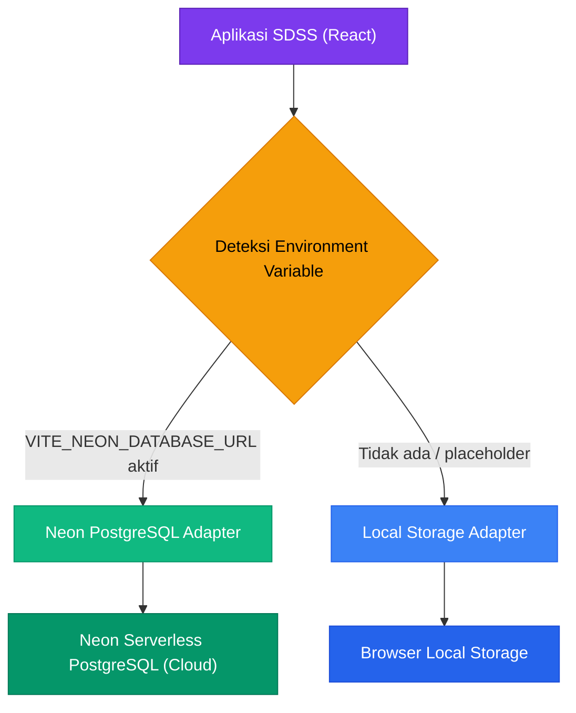
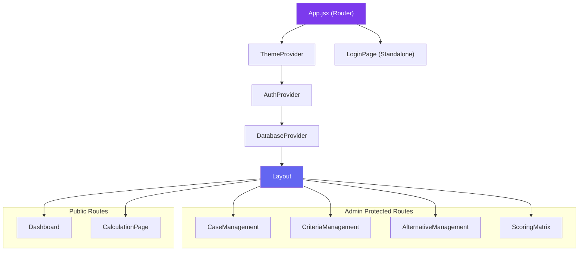
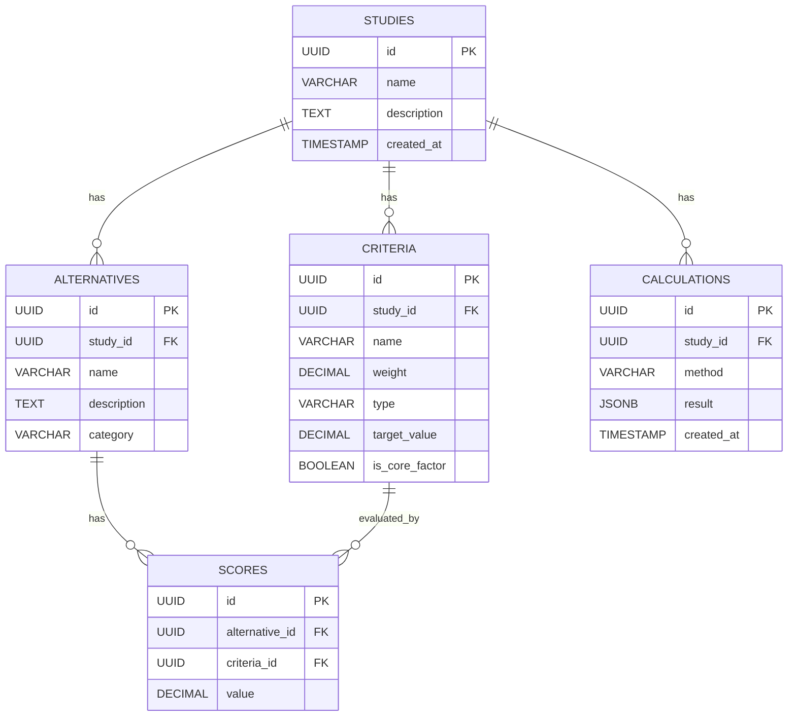

# LAPORAN TUGAS AKHIR
# Smart Decision Support System (SDSS)
# Sistem Pendukung Keputusan Berbasis Web

---

| **Informasi** | **Detail** |
|---|---|
| **Nama** | Andika Agung Triadha |
| **NIM** | 231011400165 |
| **Mata Kuliah** | Sistem Pendukung Keputusan |
| **Tanggal** | 2 Juli 2026 |

---

## DAFTAR ISI

1. [Pendahuluan](#1-pendahuluan)
2. [Deskripsi Sistem](#2-deskripsi-sistem)
3. [Teknologi yang Digunakan](#3-teknologi-yang-digunakan)
4. [Arsitektur Sistem](#4-arsitektur-sistem)
5. [Struktur Database](#5-struktur-database)
6. [Fitur-Fitur Sistem](#6-fitur-fitur-sistem)
7. [Screenshot Antarmuka Sistem](#7-screenshot-antarmuka-sistem)
8. [Metode Perhitungan SPK](#8-metode-perhitungan-spk)
9. [Implementasi Algoritma](#9-implementasi-algoritma)
10. [Struktur Direktori Proyek](#10-struktur-direktori-proyek)
11. [Cara Menjalankan Aplikasi](#11-cara-menjalankan-aplikasi)
12. [Kesimpulan](#12-kesimpulan)

---

## 1. Pendahuluan

### 1.1 Latar Belakang

Dalam era digital saat ini, pengambilan keputusan yang tepat dan akurat menjadi sangat penting dalam berbagai aspek kehidupan, baik dalam bidang bisnis, pendidikan, maupun organisasi. Proses pengambilan keputusan yang melibatkan banyak kriteria dan alternatif memerlukan metode sistematis yang didukung oleh teknologi informasi.

**Smart Decision Support System (SDSS)** merupakan sistem pendukung keputusan berbasis web yang dirancang untuk membantu pengguna dalam mengambil keputusan secara matematis dan objektif. Sistem ini mendukung berbagai metode analisis keputusan multi-kriteria (MCDM) yang dapat digunakan untuk studi kasus yang beragam, seperti pemilihan laptop, pemilihan karyawan terbaik, pemilihan beasiswa, dan lain sebagainya.

### 1.2 Tujuan

1. Membangun sistem pendukung keputusan yang universal dan fleksibel untuk berbagai studi kasus.
2. Mengimplementasikan 7 metode perhitungan SPK: **SAW, WP, TOPSIS, SMART, Profile Matching, AHP, dan MOORA**.
3. Menampilkan proses perhitungan secara **step-by-step** dengan visualisasi matriks intermediat.
4. Menyediakan antarmuka yang modern, responsif, dan mudah digunakan.
5. Mendukung arsitektur **dual-adapter database** (Local Storage & Neon PostgreSQL).

### 1.3 Ruang Lingkup

Sistem ini mencakup:
- Manajemen studi kasus dengan operasi CRUD (Create, Read, Update, Delete)
- Pengelolaan kriteria dengan validasi bobot
- Pengelolaan alternatif keputusan
- Input matriks penilaian (scoring matrix)
- Perhitungan dan perangkingan menggunakan 7 metode SPK
- Dashboard analitik dengan visualisasi chart
- Autentikasi admin untuk operasi CRUD
- Ekspor laporan ke PDF dan CSV

---

## 2. Deskripsi Sistem

**Smart Decision Support System (SDSS)** adalah aplikasi web **Single Page Application (SPA)** yang berfungsi sebagai Sistem Pendukung Keputusan (SPK) universal. Sistem ini memungkinkan pengguna untuk:

1. **Membuat studi kasus** yang bersifat dinamis dan fleksibel
2. **Mendefinisikan kriteria** dengan bobot, tipe (benefit/cost), dan properti tambahan untuk Profile Matching
3. **Menambahkan alternatif** keputusan dengan deskripsi dan kategori
4. **Mengisi matriks penilaian** untuk setiap alternatif terhadap setiap kriteria
5. **Menjalankan perhitungan SPK** dengan menampilkan langkah-langkah intermediat
6. **Membandingkan hasil** dari berbagai metode dalam satu tampilan dashboard

Sistem ini dirancang dengan pendekatan **mobile-first** dan mendukung **dark mode** untuk kenyamanan pengguna.

---

## 3. Teknologi yang Digunakan

| **Kategori** | **Teknologi** | **Versi** | **Keterangan** |
|---|---|---|---|
| **Frontend Framework** | React | 19.2.7 | Library JavaScript untuk membangun UI interaktif |
| **Build Tool** | Vite | 8.1.0 | Build tool modern yang sangat cepat |
| **Styling** | Tailwind CSS | 3.4.19 | Utility-first CSS framework |
| **Routing** | React Router DOM | 7.18.0 | Client-side routing untuk SPA |
| **Charts** | Recharts | 3.9.0 | Library chart untuk React (Pie, Bar, Radar) |
| **Form Management** | React Hook Form | 7.80.0 | Pengelolaan form yang performant |
| **Validation** | Zod | 4.4.3 | Schema validation untuk form input |
| **Icons** | Lucide React | 1.21.0 | Icon library modern dan ringan |
| **Database (Cloud)** | Neon PostgreSQL | 1.1.0 | Serverless PostgreSQL database |
| **Database (Local)** | Local Storage | Built-in | Penyimpanan browser untuk mode offline |
| **Linting** | OxLint | 1.69.0 | Linter JavaScript yang cepat |
| **Cross-Platform** | Capacitor | 8.4.1 | Framework untuk build mobile (Android/iOS) |

---

## 4. Arsitektur Sistem

### 4.1 Arsitektur Dual-Adapter Database

Sistem SDSS menggunakan arsitektur **Dual-Adapter Database** yang inovatif, memungkinkan aplikasi berjalan dalam dua mode:



### 4.2 Arsitektur Komponen React



### 4.3 Flow Pengambilan Keputusan

```mermaid
graph LR
    A["1. Buat Studi Kasus"] --> B["2. Definisi Kriteria & Bobot"]
    B --> C["3. Input Alternatif"]
    C --> D["4. Isi Matriks Penilaian"]
    D --> E["5. Pilih Metode SPK"]
    E --> F["6. Lihat Hasil & Ranking"]
    F --> G["7. Ekspor Laporan"]
    
    style A fill:#7C3AED,color:#fff
    style B fill:#6366F1,color:#fff
    style C fill:#818CF8,color:#fff
    style D fill:#A78BFA,color:#fff
    style E fill:#C4B5FD,color:#000
    style F fill:#10B981,color:#fff
    style G fill:#059669,color:#fff
```



---

## 5. Struktur Database

### 5.1 Entity Relationship Diagram



### 5.2 Deskripsi Tabel

| **Tabel** | **Fungsi** | **Relasi** |
|---|---|---|
| `studies` | Menyimpan studi kasus SPK | Parent dari criteria, alternatives, calculations |
| `criteria` | Menyimpan kriteria penilaian (bobot, tipe, target) | Belongs to studies, referenced by scores |
| `alternatives` | Menyimpan alternatif keputusan | Belongs to studies, has many scores |
| `scores` | Matriks penilaian (nilai setiap alternatif per kriteria) | Belongs to alternatives dan criteria |
| `calculations` | Log hasil perhitungan dalam format JSONB | Belongs to studies |

---

## 6. Fitur-Fitur Sistem

### 6.1 Daftar Fitur Utama

| **No** | **Fitur** | **Deskripsi** |
|---|---|---|
| 1 | **Dashboard Analitik** | Visualisasi statistik studi kasus, distribusi bobot kriteria (Pie Chart), profil performa alternatif (Radar Chart), dan perbandingan ranking (Bar Chart) |
| 2 | **Manajemen Studi Kasus** | CRUD lengkap untuk membuat, mengedit, dan menghapus studi kasus yang bersifat dinamis |
| 3 | **Manajemen Kriteria & Bobot** | CRUD kriteria, validasi total bobot (∑Wj = 1.0), tombol "Normalkan Bobot" untuk normalisasi otomatis |
| 4 | **AHP Weights Modeler** | Matriks perbandingan berpasangan interaktif untuk menghitung bobot secara otomatis dengan pengecekan Consistency Ratio (CR < 0.1) |
| 5 | **Manajemen Alternatif** | CRUD untuk alternatif keputusan dengan dukungan kategori dan tags |
| 6 | **Matriks Penilaian Dinamis** | Interface grid untuk mengisi nilai evaluasi setiap alternatif terhadap semua kriteria |
| 7 | **7 Metode SPK Step-by-Step** | Visualisasi matriks intermediat dan langkah perhitungan untuk SAW, WP, TOPSIS, SMART, Profile Matching, AHP, dan MOORA |
| 8 | **Autentikasi Admin** | Proteksi operasi CRUD dengan login admin (Email: admin@sdss.com, Password: admin) |
| 9 | **Premium UI/UX** | Layout responsif mobile-first, dark mode, transisi halus, custom scrollbar, dan print-ready styles |
| 10 | **Ekspor Laporan** | Cetak laporan PDF, ekspor CSV kompatibel Excel, dan simpan log perhitungan ke histori database |

---

## 7. Screenshot Antarmuka Sistem

### 7.1 Halaman Dashboard (Public View)

Halaman utama yang menampilkan gambaran umum sistem dengan hero banner, statistik studi kasus, dan visualisasi chart.


---

### 7.2 Halaman Login Admin

Halaman autentikasi untuk admin dengan form email dan password. Mendukung kredensial default untuk kemudahan demo.


---

### 7.3 Dashboard Setelah Login (Admin View)

Dashboard dengan navigasi lengkap termasuk menu CRUD yang hanya tersedia setelah autentikasi berhasil.


---

### 7.4 Halaman Manajemen Studi Kasus

Interface CRUD untuk mengelola studi kasus SPK. Menampilkan tabel dengan search, pagination, dan aksi (Edit/Hapus).


---

### 7.5 Halaman Manajemen Kriteria

Interface untuk mendefinisikan kriteria penilaian dengan bobot, tipe (benefit/cost), target value, dan status core/secondary factor.


---

### 7.6 Halaman Manajemen Alternatif

Interface untuk mengelola alternatif keputusan dengan nama, deskripsi, dan kategori.


---

### 7.7 Halaman Input Penilaian (Scoring Matrix)

Grid interface untuk mengisi nilai evaluasi setiap alternatif terhadap semua kriteria yang telah didefinisikan.


---

### 7.8 Halaman Perhitungan & Hasil

Interface untuk menjalankan perhitungan SPK, memilih metode, dan melihat hasil ranking beserta langkah-langkah intermediat.


---

## 8. Metode Perhitungan SPK

### 8.1 SAW (Simple Additive Weighting)

**Langkah-langkah:**
1. Buat Matriks Keputusan
2. Normalisasi Matriks:
   - **Benefit:** R_ij = x_ij / max(x_kj)
   - **Cost:** R_ij = min(x_kj) / x_ij
3. Hitung Matriks Berbobot: V_ij = R_ij × w_j
4. Jumlahkan nilai berbobot: V_i = ∑(w_j × R_ij)
5. Ranking berdasarkan V_i (descending)

> [!NOTE]
> SAW adalah metode paling sederhana dan paling banyak digunakan. Cocok untuk kasus dengan kriteria yang jelas dan mudah dikuantifikasi.

---

### 8.2 WP (Weighted Product)

**Langkah-langkah:**
1. Normalisasi Bobot (∑w = 1)
2. Hitung Vektor S: S_i = ∏(x_ij^w'_j), dimana w'_j negatif untuk kriteria cost
3. Hitung Vektor V: V_i = S_i / ∑S_k
4. Ranking berdasarkan V_i (descending)

> [!NOTE]
> WP tidak memerlukan normalisasi terlebih dahulu karena menggunakan operasi perkalian berpangkat.

---

### 8.3 TOPSIS (Technique for Order Preference by Similarity to Ideal Solution)

**Langkah-langkah:**
1. Normalisasi: R_ij = x_ij / √(∑x_kj²)
2. Matriks Normalisasi Berbobot: V_ij = R_ij × w_j
3. Tentukan Solusi Ideal Positif (A⁺) dan Negatif (A⁻)
4. Hitung Jarak ke A⁺ (D⁺) dan A⁻ (D⁻): Euclidean Distance
5. Hitung Preferensi: C_i = D⁻_i / (D⁺_i + D⁻_i)
6. Ranking berdasarkan C_i (descending)

> [!IMPORTANT]
> TOPSIS menggunakan konsep jarak ke solusi ideal. Alternatif terbaik adalah yang paling dekat ke solusi ideal positif dan paling jauh dari solusi ideal negatif.

---

### 8.4 SMART (Simple Multi-Attribute Rating Technique)

**Langkah-langkah:**
1. Normalisasi Bobot (∑w = 1)
2. Hitung Nilai Utility:
   - **Benefit:** U_ij = 100 × (x_ij − min) / (max − min)
   - **Cost:** U_ij = 100 × (max − x_ij) / (max − min)
3. Hitung Nilai Akhir: V_i = ∑(w_j × U_ij)
4. Ranking berdasarkan V_i (descending)

---

### 8.5 Profile Matching

**Langkah-langkah:**
1. Hitung GAP: GAP_ij = x_ij − Target_j
2. Mapping GAP ke Bobot berdasarkan tabel standar:

| **GAP** | **Bobot** | **Keterangan** |
|---|---|---|
| 0 | 5.0 | Tidak ada selisih |
| +1 | 4.5 | Melebihi 1 level |
| −1 | 4.0 | Kurang 1 level |
| +2 | 3.5 | Melebihi 2 level |
| −2 | 3.0 | Kurang 2 level |
| +3 | 2.5 | Melebihi 3 level |
| −3 | 2.0 | Kurang 3 level |
| +4 | 1.5 | Melebihi 4 level |
| −4 | 1.0 | Kurang 4 level |

3. Hitung Rata-rata Core Factor (CF) dan Secondary Factor (SF)
4. Total = 0.6 × CF + 0.4 × SF
5. Ranking berdasarkan Total (descending)

---

### 8.6 AHP (Analytic Hierarchy Process)

**Langkah-langkah Perhitungan Bobot:**
1. Bangun Matriks Perbandingan Berpasangan (n × n)
2. Hitung jumlah setiap kolom
3. Normalisasi matriks (bagi setiap sel dengan jumlah kolomnya)
4. Hitung Priority Vector (rata-rata baris dari matriks ternormalisasi)
5. Uji Konsistensi:
   - λ_max = ∑(Column_Sum_j × Weight_j)
   - CI = (λ_max − n) / (n − 1)
   - CR = CI / RI (Random Index dari tabel Saaty)
   - **Konsisten jika CR < 0.1**

**Tabel Random Index (RI) Saaty:**

| **n** | 1 | 2 | 3 | 4 | 5 | 6 | 7 | 8 | 9 | 10 |
|---|---|---|---|---|---|---|---|---|---|---|
| **RI** | 0.00 | 0.00 | 0.58 | 0.90 | 1.12 | 1.24 | 1.32 | 1.41 | 1.45 | 1.49 |

**Langkah Sintesis Alternatif:**
1. Normalisasi skor: Benefit: R_ij = x_ij / ∑x_kj; Cost: R_ij = (1/x_ij) / ∑(1/x_kj)
2. Hitung Skor Akhir: V_i = ∑(w_j × R_ij)
3. Ranking descending

---

### 8.7 MOORA (Multi-Objective Optimization on the basis of Ratio Analysis)

**Langkah-langkah:**
1. Normalisasi: R_ij = x_ij / √(∑x_kj²)
2. Matriks Normalisasi Berbobot: V_ij = R_ij × w_j
3. Hitung Nilai Optimasi: y_i = ∑V_ij(benefit) − ∑V_ij(cost)
4. Ranking berdasarkan y_i (descending)

> [!TIP]
> MOORA memiliki keunggulan dalam menangani optimasi multi-objektif dimana kriteria benefit dijumlahkan dan kriteria cost dikurangkan langsung.

---

## 9. Implementasi Algoritma

### 9.1 Implementasi SAW

File: [saw.js](file:///c:/Users/atria/.gemini/antigravity/scratch/smart-decision-support-system/src/utils/saw.js)

```javascript
export function calculateSAW(alternatives, criteria, scores) {
  // Step 1: Build Decision Matrix
  const matrix = alternatives.map(alt => {
    const row = { alternativeId: alt.id, name: alt.name };
    criteria.forEach(crit => {
      row[crit.id] = scoreMap[`${alt.id}-${crit.id}`] ?? 0;
    });
    return row;
  });

  // Step 2: Normalization
  // Benefit: R_ij = x_ij / max(x_j)
  // Cost:    R_ij = min(x_j) / x_ij

  // Step 3: Weighted Matrix
  // V_ij = R_ij * w_j

  // Step 4-5: Preference Score & Ranking
  // V_i = sum(V_ij), sort descending
}
```

### 9.2 Implementasi TOPSIS

File: [topsis.js](file:///c:/Users/atria/.gemini/antigravity/scratch/smart-decision-support-system/src/utils/topsis.js)

```javascript
export function calculateTOPSIS(alternatives, criteria, scores) {
  // Step 1: Decision Matrix
  // Step 2: Normalization R_ij = x_ij / sqrt(sum(x_kj^2))
  // Step 3: Weighted Normalized V_ij = R_ij * w_j
  // Step 4: Ideal Solutions (A+/A-)
  // Step 5: Euclidean Distances (D+/D-)
  // Step 6: Preference C_i = D-/(D+ + D-)
  // Step 7: Rank descending
}
```

### 9.3 Implementasi WP

File: [wp.js](file:///c:/Users/atria/.gemini/antigravity/scratch/smart-decision-support-system/src/utils/wp.js)

```javascript
export function calculateWP(alternatives, criteria, scores) {
  // Step 1: Normalize weights
  // Step 2: S Vector = product(x_ij ^ w_j)
  // Step 3: V Vector = S_i / sum(S_k)
  // Step 4: Rank descending
}
```

### 9.4 Implementasi SMART

File: [smart.js](file:///c:/Users/atria/.gemini/antigravity/scratch/smart-decision-support-system/src/utils/smart.js)

```javascript
export function calculateSMART(alternatives, criteria, scores) {
  // Step 1: Normalize weights
  // Step 2: Min/Max per criterion
  // Step 3: Utility = 100 * (x - min) / (max - min) for benefit
  // Step 4: Final Value = sum(w_j * U_ij)
  // Step 5: Rank descending
}
```

### 9.5 Implementasi Profile Matching

File: [pm.js](file:///c:/Users/atria/.gemini/antigravity/scratch/smart-decision-support-system/src/utils/pm.js)

```javascript
export function calculateProfileMatching(alternatives, criteria, scores) {
  // Step 1: GAP = value - target
  // Step 2: Map GAP to weight (standard table)
  // Step 3: CF/SF averages
  // Step 4: Total = 0.6*CF + 0.4*SF
  // Step 5: Rank descending
}
```

### 9.6 Implementasi AHP

File: [ahp.js](file:///c:/Users/atria/.gemini/antigravity/scratch/smart-decision-support-system/src/utils/ahp.js)

```javascript
export function calculateAHPWeights(comparisonMatrix, criteriaIds) {
  // Column sums → Normalize → Row averages (Priority Vector)
  // Consistency: λmax, CI, CR = CI/RI
  // isConsistent = CR < 0.1
}

export function calculateAHP(alternatives, criteria, scores, customWeights) {
  // Normalization: benefit = x/sum, cost = (1/x)/sum(1/x)
  // Final Score = sum(w * R)
  // Rank descending
}
```

### 9.7 Implementasi MOORA

File: [moora.js](file:///c:/Users/atria/.gemini/antigravity/scratch/smart-decision-support-system/src/utils/moora.js)

```javascript
export function calculateMOORA(alternatives, criteria, scores) {
  // Step 1: Decision Matrix
  // Step 2: Normalization R = x / sqrt(sum(x^2))
  // Step 3: Weighted V = R * w
  // Step 4: Optimization y = sum(benefit) - sum(cost)
  // Step 5: Rank descending
}
```

---

## 10. Struktur Direktori Proyek

```
smart-decision-support-system/
├── public/
│   └── favicon.ico
├── src/
│   ├── components/              # Komponen UI Bersama
│   │   ├── Layout.jsx           # Layout utama (Sidebar + Content)
│   │   ├── Modal.jsx            # Komponen dialog modal
│   │   └── ThemeToggle.jsx      # Toggle dark/light mode
│   │
│   ├── context/                 # React Context Providers
│   │   ├── AuthContext.jsx      # State autentikasi admin
│   │   ├── DatabaseContext.jsx  # State database & studi kasus aktif
│   │   └── ThemeContext.jsx     # State tema (dark/light)
│   │
│   ├── db/                      # Database Layer
│   │   ├── client.js            # Dual-adapter DB manager (local vs neon)
│   │   ├── neonClient.js        # Neon PostgreSQL connection
│   │   ├── schema.sql           # PostgreSQL schema & indexes
│   │   ├── seed.sql             # Data seed untuk PostgreSQL
│   │   └── supabaseClient.js    # Supabase connection (opsional)
│   │
│   ├── pages/                   # Halaman Aplikasi
│   │   ├── Dashboard.jsx        # Halaman dashboard & analitik
│   │   ├── CaseManagement.jsx   # CRUD studi kasus
│   │   ├── CriteriaManagement.jsx # CRUD kriteria + AHP Modeler
│   │   ├── AlternativeManagement.jsx # CRUD alternatif
│   │   ├── ScoringMatrix.jsx    # Input matriks penilaian
│   │   ├── CalculationPage.jsx  # Perhitungan & hasil SPK
│   │   └── LoginPage.jsx        # Halaman login admin
│   │
│   ├── utils/                   # Algoritma SPK
│   │   ├── saw.js               # Simple Additive Weighting
│   │   ├── wp.js                # Weighted Product
│   │   ├── topsis.js            # TOPSIS
│   │   ├── smart.js             # SMART
│   │   ├── pm.js                # Profile Matching
│   │   ├── ahp.js               # Analytic Hierarchy Process
│   │   └── moora.js             # MOORA
│   │
│   ├── App.jsx                  # Route declarations & admin guards
│   ├── App.css                  # Custom CSS styles
│   ├── index.css                # Tailwind base & print CSS
│   └── main.jsx                 # DOM mounting
│
├── .env                         # Environment variables (Neon URL)
├── package.json                 # Dependencies & scripts
├── tailwind.config.js           # Custom theme & Outfit font
├── postcss.config.js            # PostCSS configuration
├── vite.config.js               # Vite configuration
├── capacitor.config.json        # Capacitor (mobile) config
└── README.md                    # Dokumentasi proyek
```

---

## 11. Cara Menjalankan Aplikasi

### 11.1 Prasyarat
- **Node.js** versi 18 atau lebih baru
- **NPM** (biasanya terinstal bersama Node.js)

### 11.2 Instalasi

```bash
# 1. Clone/buka direktori proyek
cd smart-decision-support-system

# 2. Install dependencies
npm install

# 3. Jalankan dev server
npm run dev
```

Aplikasi akan berjalan di `http://localhost:5173/`

### 11.3 Kredensial Admin

| **Field** | **Value** |
|---|---|
| Email | admin@sdss.com |
| Password | admin |

### 11.4 Mode Database

- **Local Storage (Default):** Aplikasi langsung berjalan tanpa konfigurasi tambahan. Data disimpan di browser.
- **Neon PostgreSQL:** Set environment variable `VITE_NEON_DATABASE_URL` di file `.env` untuk mengaktifkan mode database cloud.

---

## 12. Kesimpulan

Smart Decision Support System (SDSS) telah berhasil dibangun sebagai sistem pendukung keputusan berbasis web yang **universal, fleksibel, dan modern**. Sistem ini berhasil mengimplementasikan:

1. ✅ **7 metode SPK** (SAW, WP, TOPSIS, SMART, Profile Matching, AHP, MOORA) dengan visualisasi step-by-step
2. ✅ **Arsitektur dual-adapter database** yang mendukung Local Storage dan Neon PostgreSQL
3. ✅ **UI/UX premium** dengan dark mode, responsive design, dan animasi halus
4. ✅ **CRUD lengkap** dengan autentikasi admin untuk pengelolaan data
5. ✅ **Dashboard analitik** dengan visualisasi chart (Pie, Bar, Radar)
6. ✅ **Ekspor laporan** ke format PDF dan CSV
7. ✅ **Studi kasus dinamis** yang dapat digunakan untuk berbagai domain keputusan

Sistem ini menunjukkan bahwa teknologi web modern (React, Vite, Tailwind CSS) mampu digunakan untuk membangun aplikasi Sistem Pendukung Keputusan yang performant dan user-friendly, dengan kemampuan komputasi matematis yang akurat dan tervisualisasi dengan baik.

---

> **Disusun oleh:**
> **Andika Agung Triadha**
> **NIM: 231011400165**
> **Tanggal: 2 Juli 2026**
